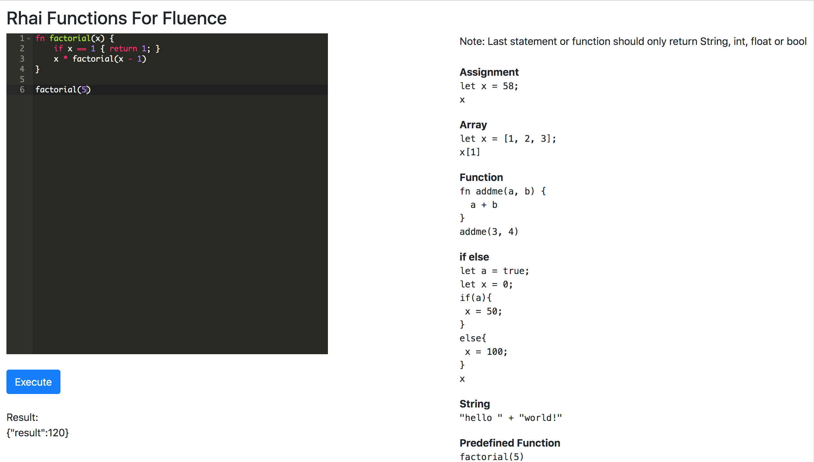

## Rhai Functions for Fluence

Rhai is an embedded scripting language for Rust (https://github.com/jonathandturner/rhai). Rhai Functions for Fluence allows you to execute Rhai functions and statements. The function can be defined in one call and it's results can be fetched from another call.


### Screenshots


### App URL
http://rhai-functions.surge.sh/ (Fluence App 402)

### Examples

**Assignment**
```
let x = 58;
x
```
{"result":58}

**Array**

```
let x = [1, 2, 3]; 
x[1]
```
{"result":2}

**Function**
```
fn addme(a, b) { 
  a + b 
}
addme(3, 4)
```
{"result":7}

**if else**
```
let a = true;
let x = 0;
if(a){
 x = 50;
}
else{
 x = 100;
}
x
```
{"result":50}

**String**
```
"hello " + "world!"
```
{"result":"hello world!"}

**Predefined Function**
```
factorial(5)
```
{"result":120}

## Getting Started

1) Clone Repo

    ```
    git clone https://github.com/viraja1/rhai_functions_fluence.git
    ```
    
2) Change directory
    
   ```
   cd rhai_functions_fluence
   ```

3) Install Rust and Cargo

4) Generate wasm build

    ```
    cargo +nightly build --lib --target wasm32-unknown-unknown --release
    ```  
    rhai_functions_fluence.wasm will be generated in target/wasm32-unknown-unknown/release

5)  Deploy generated wasm file on Fluence
    
    Deploy rhai_functions_fluence.wasm on Fluence and note down the 
    App config shown in the bottom right part of the App
    console (contract, appId, ethereumUrl)
    ```
    http://dash.fluence.network/deploy
    ```  
   
6) Update Fluence app config

    Update Fluence app config in client/src/components/config.js
    
    ```
    vi client/src/components/config.js
    ```

7) Build client app

    ```
    cd client
    npm install
    ```
    
8) Start client app

    ```
    npm start
    ```
    
9) Open client app url in chrome

    ```
    http://localhost:8080
    ```
     
10) Test the App

               
